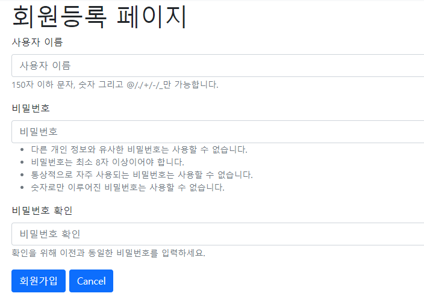
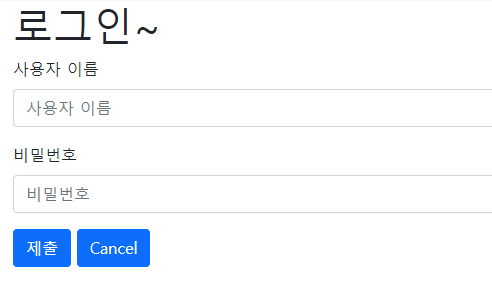

# README

> 이번 프로젝트도 익숙해진 부분들이 많았기 때문에 생각보다 수월하게 진행할 수 있었다.
>
> 이번에도 역시 vs code의 live share를 이용하여 작업할 앱을 나누어 효율적으로 작업할 수 있었다.
>
> 또한 로그인 기능 추가를 위해 이번주 동안 공부한 내용을 적용시켜보았다.


### Community

#### login_required

community는 메인으로 보여질 화면을 구성하는 앱이다.

저번주까지 누구나 사용할 수 있도록 만들어보았지만, 오늘은 인증된 사용자들만 글 작성, 수정 및 삭제를 할 수 있도록 해주었다.

이 과정은 Django에 이미 구현되어 있는 decorator를 이용해 쉽게 적용할 수 있었다.

```python
from django.contrib.auth.decorators import login_required
```

위 코드의 `@login_required`를 이용하여 로그인이 필요한 함수에만 위에 붙여주어 사용하면 된다.


하지만, delete의 경우는 다르다.

delete의 경우 `@login_required` decorator를 붙여주면, 반환이 GET 방식으로 이루어지기 때문에 정상적으로 동작하지 않는다.

그렇기 때문에 이 경우에 대해서만, 다음과 같은 코드를 사용해 로그인 제한을 만들어준다.

```python
def delete(request, pk):
    if request.user.is_authenticated:
        community = Community.objects.get(pk=pk)
        community.delete()
    return redirect('community:index')
```

`is_authenticated` 메소드는 인증된 사용자, 즉 로그인된 사용자를 의미한다. 그렇기 때문에 로그인된 사용자의 경우에만 delete 함수를 정상작동할 수 있도록 해줄 수 있다.


### Accounts

#### forms

accounts 앱에서는 회원가입, 로그인, 로그아웃 과정을 다룬다.

전체적인 함수의 내용들은,

```python
if request.method == "POST":
    pass
else:
    pass
```

의 구조를 사용하며 community 앱을 만들 때와 거의 비슷한 구조를 가진다.

다른 점이 있다면, community를 만들 때는 forms.py에 직접 form을 설계해서 만들어준 반면에, accounts에서는 django에 존재하는 form들을 사용한다는 점이다.

community는 개발자가 원하는 형태의 구조를 만들어야 하기 때문에 forms를 직접 만들어주지만, 로그인 형태는 어디에서든 비슷하기 때문에 django에서 가져와 사용하면 간편하게 만들 수 있다.


```python
from django.contrib.auth.forms import UserCreationForm, AuthenticationForm
```

대표적으로 위의 2개의 form을 사용한다.

먼저, 

`UserCreationForm`은 말그대로 create를 의미한다.

회원 가입을 할 때 사용하는 form이다.



위와 같은 형태의 form을 손쉽게 생성할 수 있다.

다음으로,

`AuthenticationForm`은 말그대로 authentic을 의미한다.

로그인을 할 때 사용하는 form이다.



위와 같은 형태의 로그인 form을 손쉽게 생성할 수 있다.


#### login, logout

login과 logout의 구조도 django에 존재하는 라이브러리를 통해 쉽게 만들수 있다.

```python
from django.contrib.auth import login as auth_login
from django.contrib.auth import logout as auth_logout
```

위의 코드를 통해 login, logout을 import해주면, login, logout 함수를 작성할 때 쉽게 작성할 수 있다.

또한, login, logout 함수를 만들면서 위의 import한 함수들과 이름이 겹치기 때문에 중복을 방지하기 위해 `as`를 통해 `auth_`의 형태로 import 해준다.


```python
auth_login(request, form.get_user())
auth_logout(request)
```

import해준 login과 logout 함수는 위와 같은 파라미터 구조를 갖게하면서 사용할 수 있다.

