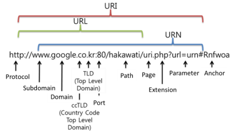

# 211025 TIL

### HTTP

##### HTTP request methods

- 자원에 대한 행위를 정의
- 주어진 리소스에 수행하길 원하는 행동을 나타냄
- GET, POST, PUT, DELETE

##### status codes

- 특정 HTTP 요청이 성공적으로 완료되었는지 여부를 나타냄
- 응답은 5개의 그룹으로 나뉨
  - Informational responses (1xx)
  - Successful responses (2xx)
  - Redirection messages (3xx)
  - Client error responses (4xx)
  - Server error responses (5xx)

#### URL, URN

- URL (Uniform Resource Locator)
  - 통합 자원 위치
  - 네트워크 상에 자원이 어디있는 지 알려주기 위한 약속
  - 과거에는 실제 자원의 위치를 나타냈지만 현재는 추상화된의미론적인 구성
  - 웹 주소, 링크라고도 불림
- URN (Uniform Resource Name)
  - 통합 자원 이름
  - URL과 달리 자원의 위치에 영향을 받지 않는 유일한 이름 역할을 함
  - 예시
    - ISBN (국제표준도서번호)

#### URL의 구조

- Scheme (protocol)
  - 브라우저가 사용해야 하는 프로토콜
  - http(s), data, file, ftp, malito
- Host (Domain name)
  - 요청을 받는 웹 서버의 이름
  - IP address를 직접 사용할 수도 있지만, 실 사용시 불편하므로 웹에서 그리 자주 사용되지는 않음
  - (google의 IP address - 142.251.42.142)
- Port
  - 웹 서버 상의 리소스에 접근하는데 사용되는 기술적인 문(Gate)
  - HTTP 프로토콜의 표준 포트
    - HTTP 80
    - HTTPS 443
- Path
  - 웹 서버 상의 리소스 경로
  - 초기에는 실제 파일이 위치한 물리적 위치를 나타냈지만, 오늘날은 물리적인 실제 위치가 아닌 추상화 형태의 구조로 표현
- Query (Identifier)
  - Query String Parameters
  - 웹 서버에 제공되는 추가적인 매개 변수
  - & 로 구분되는 key-value 목록
- Fragment
  - Anchor
  - 자원 안에서의 북마크의 한 종류를 나타냄
  - 브라우저에게 해당 문서(HTML)의 특정 부분을 보여주기 위한 방법
  - 브라우저에게 알려주는 요소이기 때문에 fragment identifier(부분 식별자)라고 부르며 # 뒤의 부분은 요청이 서버에 보내지지 않음

### RESTful API

#### API

- Application Programming Interface
- 프로그래밍 언어가 제공하는 기능을 수행할 수 있게 만든 인터페이스
  - 애플리케이션과 프로그래밍으로 소통하는 방법
  - CLI는 명령줄, GUI는 그래픽, API는 프로그래밍을 통해 특정한 기능 수행
- Web API
  - 웹 애플리케이션 개발에서 다른 서비스에 요청을 보내고 응답을 받기 위해 정의된 명세
  - 현재 웹 개발은 모든 것을 직접 개발하기보다 여러 Open API를 활용하는 추세
- 응답 데이터 타입
  - HTML, XML, JSON 등
- 대표적인 API 서비스 목록
  - Youtube API, Naver Papago API, Kakao Map API, ...

#### REST

- REpresentational State Transfer
- API Server를 개발하기 위한 일종의 소프트웨어 설계 방법론
- 네트워크 구조(Network Architecture) 원리의 모음
  - 자원을 정의하고 자원에 대한 주소를 지정하는 전반적인 방법
- REST 원리를 따르는 시스템을 RESTful이란 용어로 지칭함
- 자원을 정의하는 방법에 대한 고민
  - ex) 정의된 자원을 어디에 위치시킬 것인가
- REST 자원과 주소의 지정 방법
  - 자원
    - URI
  - 행위
    - HTTP Method (GET / POST / PUT / DELETE)
  - 표현
    - 자원과 행위를 통해 궁극적으로 표현되는 (추상화된) 결과물
    - JSON으로 표현된 데이터를 제공

- JSON (JavaScript Object Notation)
  - JSON is a lightweight data-interchange format
  - JavaScript의 표기법을 따른 단순 문자열
- 특징
  - 사람이 읽거나 쓰기 쉽고 기계가 파싱(해석, 분석)하고 만들어내기 쉬움
  - 파이썬의 dictionary, 자바스크립트의 object처럼 C 계열의 언어가 갖고 있는 자료구조로 쉽게 변화할 수 있는 key-value 형태의 구조를 갖고 있음
- REST의 핵심 규칙
  1. 정보는 URI로 표현
  2. 자원에 대한 행위는 HTTP Method로 표현 (GET, POST, PUT, DELETE)
- 설계 방법론을 지키지 않았을 때 잃는 것보다 지켰을 때 얻는 것이 훨씬 많음
  - 설계 방법론을 지키지 않았더라도 동작여부에 큰 영향을 미치지는 않음 -> 지키면 좋을 것 같아요~정도

##### RESTful API

- REST 원리를 따라 설계한 API
- RESTful services, 혹은 simply REST services라고도 부름
- 프로그래밍을 통해 클라이언트의 요청에 JSON을 응답하는 서버를 구성
  - 지금까지 사용자의 입장에서 썼던 API를 제공자의 입장이 되어 개발해보기

##### TIP

> **직렬화** - DB의 내용을 JSON으로 바꾸어주어 사용자에게 가져오는 것
>
> **역직렬화** - JSON 같은 데이터 구조를 DB로 옮길 수 있도록 해주는 것
>
> +) python manage.py **seed** articles --number=20
> -> 랜덤으로 20개의 데이터 articles에 추가

