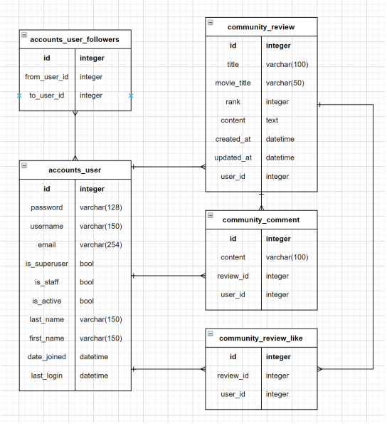

# README

> 이번 프로젝트는 오랜만에 하는 프로젝트라 그런지, 기억이 조금 안나는 부분들이 있었다. 또한, 관계 설정을 해주는 부분에서 조금 헤매었다. 하지만 금방 구성을 떠올려서 구현할 수 있었다.


### Model

전체 프로젝트의 모델들을 다음의 ERD에 맞춰서 관계를 설정해주어야 한다.



`accounts`앱에서는 User라는 유저모델을 하나만 만들어서 자기 자신을 ManyToManyField로 이어주면 `accounts_user`와 `accounts_user_followers`를 만들어줄 수 있다.

`community`앱에서는 `review`와 `comment`를 만들어주고, `review`는 `user`에 한번은 1:N으로 ForeignKey로 이어주고, 좋아요를 위해 `user`에 ManyToManyField로 다시 한 번 이어준다. 
또한 `comment`는 `review`와 `user`에 각각 ForeignKey로 이어준다. 그러면 위와 같은 ERD 다이어그램에 맞게 모델의 연결관계를 완성할 수 있다.

ManyToManyField를 이용하는 경우에는 모두 related_name을 꼭 설정해준다.

```python
from django.db import models
from django.contrib.auth.models import AbstractUser

# Create your models here.
class User(AbstractUser):
    followings = models.ManyToManyField('self', symmetrical=False, related_name='followers')
```

```python
from django.db import models
from django.conf import settings


# Create your models here.
class Review(models.Model):
    RANKS = [
        (1, '★'),
        (2, '★★'),
        (3, '★★★'),
        (4, '★★★★'),
        (5, '★★★★★'),
    ]
    
    title = models.CharField(max_length=100)
    movie_title = models.CharField(max_length=50)
    rank = models.IntegerField(choices=RANKS, default=5)
    content = models.TextField()
    created_at = models.DateTimeField(auto_now_add=True)
    updated_at = models.DateTimeField(auto_now=True)
    user = models.ForeignKey(settings.AUTH_USER_MODEL, on_delete=models.CASCADE)
    like_users = models.ManyToManyField(settings.AUTH_USER_MODEL, related_name='review_like')
    
    def __str__(self):
        return f'{self.title}'


class Comment(models.Model):
    content = models.CharField(max_length=100)
    review = models.ForeignKey(Review, on_delete=models.CASCADE)
    user = models.ForeignKey(settings.AUTH_USER_MODEL, on_delete=models.CASCADE)

    def __str__(self):
        return f'{self.content}'
```


### Form

`user`, `review`, `comment` 모델 모두 각각 필요한 내용을 다루기 위해 Form을 만들어 주어야 한다. 조건에 맞춰 각각 다음과 같이 상속을 통해 쉽게 구현할 수 있다.

```python
from django.contrib.auth.forms import UserChangeForm, UserCreationForm
from django.contrib.auth import get_user_model


class CustomUserChangeForm(UserChangeForm):

    class Meta:
        model = get_user_model()
        fields = ('email', 'first_name', 'last_name',)


class CustomUserCreationForm(UserCreationForm):

    class Meta(UserCreationForm.Meta):
        model = get_user_model()
        fields = UserCreationForm.Meta.fields + ('email',)
```

```python
from django import forms
from .models import Review, Comment


class ReviewForm(forms.ModelForm):

    class Meta:
        model = Review
        # 사용자에게 보여줄 & is_valid() 에서 검증할 필드들
        fields = ('title', 'content', 'rank',)


class CommentForm(forms.ModelForm):
    content = forms.CharField(
        min_length=2,
        max_length=200,
        widget=forms.TextInput(attrs={'autofocus': True})
    )
    
    class Meta:
        model = Comment
        # 사용자에게 보여줄 & is_valid() 에서 검증할 필드들
        fields = ('content', )
```


### 상세 구현

상세적으로 웹 화면을 구현하는 부분에서는 이전의 프로젝트들과 동일하게 로그인, 게시글 작성, 댓글 작성 등의 방법을 이용하여 구현했다.

이전과의 차별점은 관계 설정이 있기 때문에 이를 참조하고 역참조하는 부분이다. 이를 이용하여 팔로우와 좋아요를 구현했다. 예를 들어 `user` 모델에서 **followings**라는 변수로 정방향으로 참조를 진행하여 **following**을 알아내는 과정이 있었다면,  `related_name`으로 설정해준 **followers**라는 변수를 통해 역방향으로 참조를 진행하여 **follower**를 알아내는 과정도 존재했다.
이 과정은 상당히 헷갈렸는데, ERD 다이어그램을 참고하면서 진행하니 그래도 잘 풀어낼 수 있었다. 이번 프로젝트를 통해 확실하게 이 부분을 이해할 수 있었던 것 같다.


