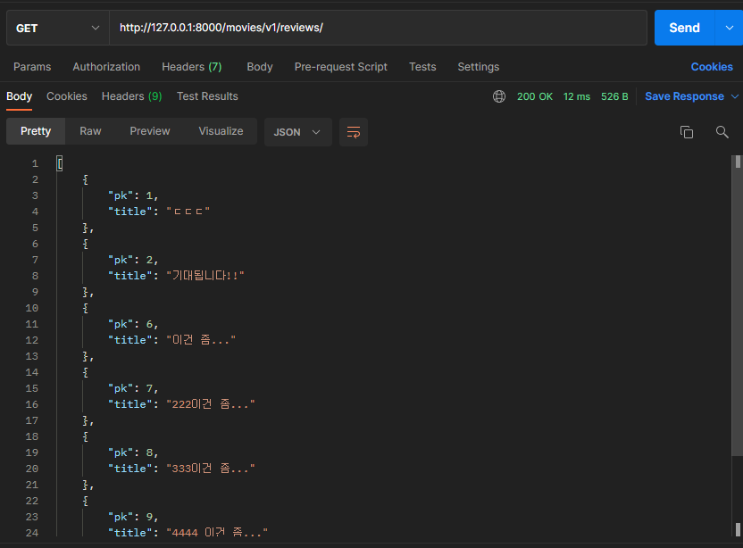
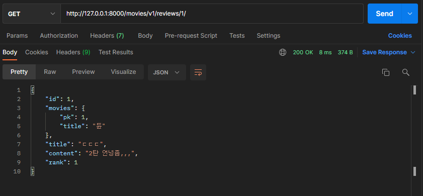

# README.md

> DRF 활용은 아직 조금 헷갈린다. 조금 더 작동 구조에 대해 이해해봐야할 필요가 있을 것 같다.


### Model


위와 같은 구조를 가져야 하므로, **movie**와 **actor**를 `ManyToManyField`로 연결해주었고, **movie**와 **review**를 1:N의 관계를 위해 `ForeignKey`로 연결해주었다.


### Serializer & View

> 이 부분이 가장 헷갈렸다.
>
> views.py에서 serializer의 사용을 위해 각 객체별로 serializer를 만들어 주었는데, 각 객체별로 참조하는 변수들이나, POST, PUT 입력 시 사용되는 변수들에 대해 고려해주어야했기 때문에 조금 헤맸던 것 같다. 
>
> 하지만 이제 어느 정도 이해가 된 것 같다.

```python
from rest_framework import serializers
from ..models import Actor


class ActorListSerializer(serializers.ModelSerializer):

    class Meta:
        model = Actor
        fields = ('pk', 'name', )


class ActorSerializer(serializers.ModelSerializer):

    class Meta:
        model = Actor
        fields = ('pk', 'name', 'movies')
```

```python
from rest_framework import serializers
from ..models import Movie, Actor, Review


class MovieListSerializer(serializers.ModelSerializer):

    class Meta:
        model = Movie
        fields = ('pk', 'title', )


class MovieSerializer(serializers.ModelSerializer):

    class ActorSerializer(serializers.ModelSerializer):
        class Meta:
            model = Actor
            fields = ('pk', 'name', )

    class ReviewSerializer(serializers.ModelSerializer):
        class Meta:
            model = Review
            fields = ('pk', 'title')

    reviews = ReviewSerializer(many=True, read_only=True)
    actors = ActorSerializer(many=True, read_only=True)
    actor_pks = serializers.ListField(write_only=True)

    def create(self, validated_data):
        actor_pks = validated_data.pop('actor_pks')
        movie = Movie.objects.create(**validated_data)
        for actor_pk in actor_pks:
            movie.actors.add(actor_pk)
        return movie

    class Meta:
        model = Movie
        fields = '__all__'
```

```python
from rest_framework import serializers
from ..models import Movie, Review


class ReviewListSerializer(serializers.ModelSerializer):

    class Meta:
        model = Review
        fields = ('pk', 'title', )


class ReviewSerializer(serializers.ModelSerializer):

    class MovieSerializer(serializers.ModelSerializer):
        class Meta:
            model = Movie
            fields = ('pk', 'title')
    
    movies = MovieSerializer(read_only=True)  # POST 입력 시 입력 필요 X => read_only이므로

    def create(self, validated_data):
        review = Review.objects.create(**validated_data)
        return review

    def update(self, review, validated_data):
        for attr, value in validated_data.items():
            setattr(review, attr, value)
            review.save()
        return review

    class Meta:
        model = Review
        fields = '__all__'
```

각각의 model들을 위해 모두 따로 serializer들을 만들어 주었다.

각 model들이 참조하는 모델과 pk값 등 다양한 추가적인 변수들을 사용해주기 위해 serializer에서 참조하는 model의 serializer를 새로 선언하는 등의 작업이 필요했다.

.

또한, 조건에 맞춰 리뷰의 생성, 수정 및 삭제, 영화의 생성 등을 구현하기 위해 다음과 같이 views.py를 구성했다.

```python
import re
from django.shortcuts import get_object_or_404
from rest_framework import serializers, status
from rest_framework.decorators import api_view
from rest_framework.response import Response

from .models import Actor, Movie, Review

from .serializers.actor import ActorListSerializer, ActorSerializer
from .serializers.movie import MovieListSerializer, MovieSerializer
from .serializers.review import ReviewListSerializer, ReviewSerializer


@api_view(['GET'])
def actor_list(request):
    actors = Actor.objects.all()
    serializer = ActorListSerializer(actors, many=True)
    return Response(serializer.data)
    

@api_view(['GET'])
def actor_detail(request, actor_pk):
    actor = get_object_or_404(Actor, pk=actor_pk)
    serializer = ActorSerializer(actor)
    return Response(serializer.data)


@api_view(['GET', 'POST'])
def movie_list(request):
    if request.method == 'GET':
        movies = Movie.objects.all()
        serializer = MovieListSerializer(movies, many=True)
        return Response(serializer.data)
    elif request.method == 'POST':
        serializer = MovieSerializer(data=request.data)
        if serializer.is_valid(raise_exception=True):
            serializer.save()
            return Response(serializer.data)
    

@api_view(['GET'])
def movie_detail(request, movie_pk):
    movie = get_object_or_404(Movie, pk=movie_pk)
    serializer = MovieSerializer(movie)
    return Response(serializer.data)


@api_view(['GET'])
def review_list(request):
    reviews = Review.objects.all()
    serializer = ReviewListSerializer(reviews, many=True)
    return Response(serializer.data)


@api_view(['GET'])
def review_detail(request, review_pk):
    review = get_object_or_404(Review, pk=review_pk)
    serializer = ReviewSerializer(review)
    return Response(serializer.data)


@api_view(['POST'])
def create_review(request, movie_pk):
    movie = get_object_or_404(Movie, pk=movie_pk)
    serializer = ReviewSerializer(data=request.data)
    if serializer.is_valid(raise_exception=True):
        serializer.save(movies=movie)
        return Response(serializer.data)


@api_view(['GET', 'PUT', 'DELETE'])
def review_detail_or_update_or_delete(request, movie_pk, review_pk):
    movie = get_object_or_404(Movie, pk=movie_pk)
    review = get_object_or_404(Review, pk=review_pk)

    if request.method == 'GET':
        review.save()
        serializer = ReviewSerializer(review)
        return Response(serializer.data)

    elif request.method == 'PUT':
        serializer = ReviewSerializer(instance=review, data=request.data)
        if serializer.is_valid(raise_exception=True):
            serializer.save(movies=movie)
            return Response(serializer.data)

    else:
        review.delete()
        return Response(status=status.HTTP_204_NO_CONTENT)
```


### Test

1. 전체 배우 목록

   

2. 단일 배우 정보

   

3. 전체 영화 목록

   

4. 단일 영화 정보

   

5. 영화 데이터 생성

   

6. 전체 리뷰 목록

   

7. 단일 리뷰 목록

   

8. 리뷰 생성, 수정, 삭제

   

   

   

   

