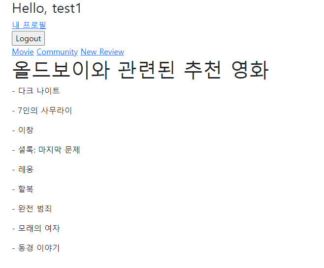

# README

> 팔로우와 좋아요 기능은 생각보다 순조롭게 할 수 있었다.
> 하지만 movies app을 만드는 과정이 조금 복잡했는데, fixtures의 json 데이터를 가져오는 과정이 처음 접해보는 과정이어서 조금 헤맸던 것 같다.
> 또한, 추천 시스템을 구현하는 과정에서 pandas를 통해 컨텐츠 기반 필터링 기법을 이용했는데, 이 과정이 쉽지 않았다.


### AJAX

팔로우와 좋아요 기능의 비동기적 구현을 위해 JS를 사용하여 html 파일 내에 script문을 구성해주었다.

팔로우와 좋아요 모두 axios를 사용하여 버튼을 클릭하여 form의 submit 이벤트가 발생하면 POST 방식을 이용해 작동하도록 구성해주었다.

또한 팔로우와 좋아요 아이콘의 비동기적인 변화를 위해 버튼을 클릭하는 이벤트에서 내부의 글귀나 아이콘 문양이 바뀌도록 innerText 등으로 설정해주었고, views.py 파일 내의 함수 변경을 통해 현재 팔로우, 좋아요가 되고 있는지, 또 그리고 그렇다면 개수가 몇개인지를 카운트하여 화면에 출력할 수 있도록 querySelector를 통해 연결해주었다.

id와 class 연결을 통해 코드를 구성해주어 코드를 이해하기에 가독성이 좋았는데, 변수명을 설정해주는 것이 가장 어려웠다.


### fixtures

```bash
$ python manage.py migrate
$ python manage.py loaddata [app_name]/fixtures/[fixture_name].json
$ python manage.py runserver
```

위 과정을 통해 movies/fixtures/내의 movies.json의 내용을 데이터로 바로 넣어줄 수 있었다.

과정 자체는 간단하지만, fixtures내의 json 파일을 처음에 못찾았다가 loaddata의 방법을 떠올리지 못해 조금 헤맸던 것 같다.

하지만 간단하게 데이터들을 로드하는 방법이라고 생각하기 때문에 앞으로 잊지 못할 것 같다.


### Content-based Filtering

영화 추천을 구현하기 위해 컨텐츠 기반 필터링의 방법을 사용하기로 했다.

컨텐츠 기반 필터링은 '내용(Content)'에 알맞는 아이템을 추천해주는 것으로, 프로젝트에서 '내용(Content)'은 영화 제목을 의미한다.

그래서 영화 제목을 입력하면, 입력받은 영화의 장르에 맞춰 연관있는 장르의 평점 높은 영화를 추천해주도록 시스템을 구성해 주었다.

먼저, 영화의 장르는 문자열로 구성되어 있기 때문에, CountVectorizer를 통해 벡터화 시켜주었다. 또한 벡터화된 값들을 기준으로 코사인 유사도를 계산하여 유사한 장르의 인덱스를 찾아주도록 만들어 주었다.

그 후 계산된 인덱스를 가지고 본인을 제외한 타겟 영화와 비슷한 코사인 유사도 값을 갖는 인덱스들을 찾아 평점 기준으로 상위 10개의 영화만 가져올 수 있도록 함수를 구성해주었다.

다음의 함수는 위 내용을 포함하고 있는 함수이다.

판다스의 데이터 프레임 형태를 사용하기 위해 전처리과정에서 간단한 방법이 떠오르지 않아 하드 코딩으로 복잡한 코드를 구현했지만, 데이터의 개체 수가 100개로 굉장히 적기 때문에 시간에 있어서 문제가 되지는 않는다고 생각한다.

```python
import pandas as pd
from sklearn.feature_extraction.text import CountVectorizer
from sklearn.metrics.pairwise import cosine_similarity


df = pd.read_json('test.json')
df_a = df.iloc[:19]
df_b = df.iloc[19:]

df_final = pd.DataFrame()
newdata = {}
newdata = {'id': [], 'title': [],'genres': [], 'vote_average': []}
    
for i in range(len(df_b)):
    newdata['id'].append(df_b.iloc[i]['pk'])
    newdata['title'].append(df_b.iloc[i]['fields']['title'])
    genre_list = []
    for j in df_b.iloc[i]['fields']['genres']:
        for k in range(len(df_a)):
            if df_a.iloc[k]['pk'] == j:
                genre_list.append(df_a.iloc[k]['fields']['name'])
    newdata['genres'].append(" ".join(genre_list))
    newdata['vote_average'].append(df_b.iloc[i]['fields']['vote_average'])
df_new = pd.DataFrame(newdata)

count_vect = CountVectorizer(min_df=0, ngram_range=(1,3))
genre_mat = count_vect.fit_transform(df_new['genres'])
genre_sim = cosine_similarity(genre_mat, genre_mat)
genre_sim_sorted_ind = genre_sim.argsort()[:, ::-1]


def func(df, movie_title, top=10):
    # 특정 영화정보 뽑아내기 
    tmi = df[df['title'] == movie_title].index.values
    # 타겟 영화와 비슷한 코사인 유사도값
    sim_index = genre_sim_sorted_ind[tmi, :top].reshape(-1)
    # 본인 제외
    sim_index = sim_index[sim_index != tmi]
    # data frame으로 만들고 vote_count 값으로 정렬한 뒤 return
    result = df.iloc[sim_index].sort_values('vote_average', ascending=False)[:10]
    return result

```


### images

1. movies index

   

2. movies detail

   

3. community index

   

4. accounts profile

   

5. recommended

   

6. result

   

