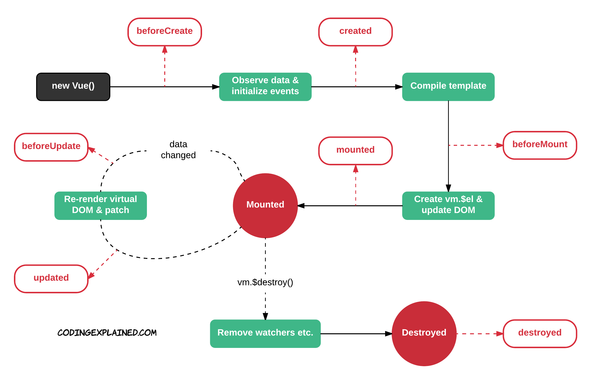

# 211104 TIL

### Lifecycle Hooks

- beforeCreate
  - 뷰 객체가 생성된 직후
  - 아직 아무런 function이나 data들이 없는 상태
  - 그렇기 때문에 잘 사용하지 않는다.
- created
  - 뷰 객체가 생성되고 난 후
  - function이나 data들이 생성되어 있는 상태
  - 뷰 객체 내의 element들을 사용할 수 있기 때문에 `초기화` 또는 `생성`의 단계를 말하면 보통 created를 사용한다.
- beforeMount
  - html 부분이 생성된 상태
  - 아직 뷰 객체와 html 부분의 결합이 이루어지지 않은 상태
- mounted
  - 뷰 객체와 html 부분의 결합이 이루어진 상태
  - 완전한 코드가 완성되어 있는 상태
- beforeUpdate
  - data의 변화가 생긴 상태
  - data의 변화만 있었지 아직 적용은 되지 않은 상태
- updated
  - data의 변화 후에 적용이 되어 있는 상태
  - mounted 직후처럼 완전하게 코드가 완성되어 있는 상태