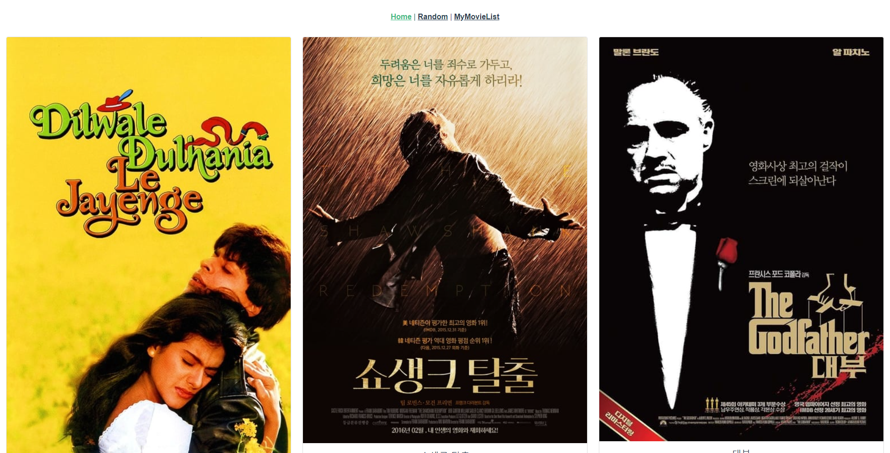
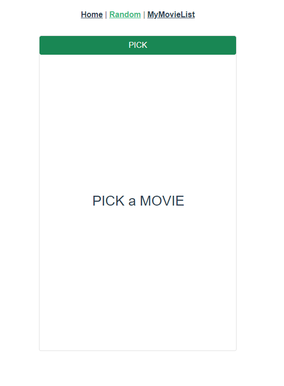
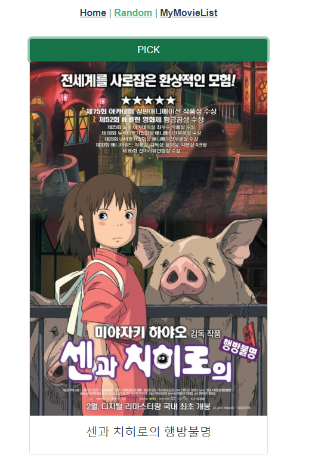
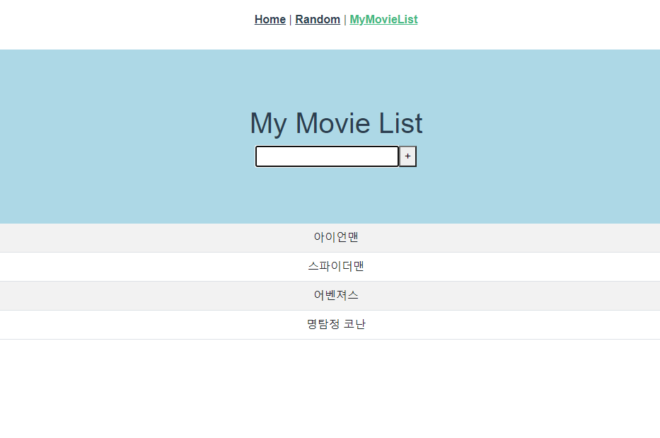

# pjt-10

> 프로젝트의 구성 자체는 그렇게 크게 어렵지 않았다.
>
> 하지만 JS와 Vue에서의 문법들이 조금 헷갈리거나 안맞는 부분들이 있었어서, 이 부분에서 조금 헤매었다.
> 특히 Bootstrap을 적용하는 부분에서 src="..."이 오류를 만드는 지를 몰랐기 때문에, 이 부분에서 시간을 많이 쓰게 되었다.
>
> 또한 디자인을 구성할 때, 테이블의 크기가 생각대로 정해지지 않아 어려웠던 것 같다. 결과는 잘 만들어졌지만, 과정 중에 헷갈렸던 부분들이 조금씩 있었다.


## BASIC OPTIONS

## Project setup
```
npm install
```

### Compiles and hot-reloads for development
```
npm run serve
```

### Compiles and minifies for production
```
npm run build
```

### Lints and fixes files
```
npm run lint
```

### Customize configuration
See [Configuration Reference](https://cli.vuejs.org/config/).


## MY OPTIONS

### Home

Home 부분은 구성은 쉬웠지만, Bootstrap 때문에 시간을 많이 쓴 부분이다.

v-for로 components로 사용한 MovieCard를 연결해주어 Bootstrap의 Card를 이용해주어 화면을 구성해주었다.

이 부분에서 img :src="..."인 부분 등의 "..."을 유의해주어야 한다는 것을 알 수 있었다.




### Random

Random은 lodash의 random을 가져와 사용했고, 인덱스를 통해 다뤄주었기 때문에 쉽게 구성할 수 있었다.

한 가지 헷갈렸던 점은, selectedMovieCard이라는 만들어준 변수가 비어있는 경우에 출력을 어떻게 하느냐는 것 이었다.

이는 v-if문을 flag를 사용하면서 나눠주어 해결했으며, flag의 true, false 유무에 따라 화면이 전환되도록 구성되었다.





### MyMovieList

MyMovieList는 이전에 TODO 리스트를 구성하면서 사용했던 Vue에서 테이블을 구성하는 방법을 적용했다.

일단 입력 후 +버튼이나 엔터를 누르면 테이블에 추가되는 부분만 구현했는데, 디자인적인 요소를 꾸밀 때 테이블이 원하는 대로 되지 않는다는 것을 알았다.

그래서 모든 태그들을 대상으로 class를 설정해주면서 여러 실험을 통해 반복해본 결과, 다행히 원하는 디자인으로 구성되는 것을 확인할 수 있었다.



